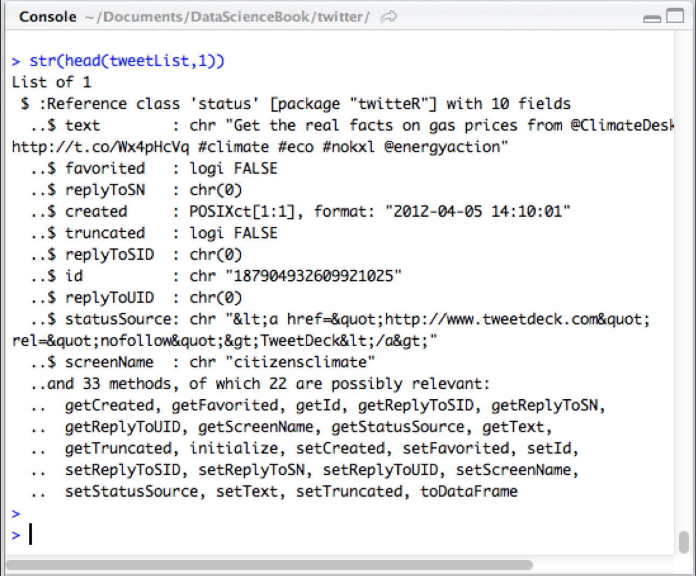
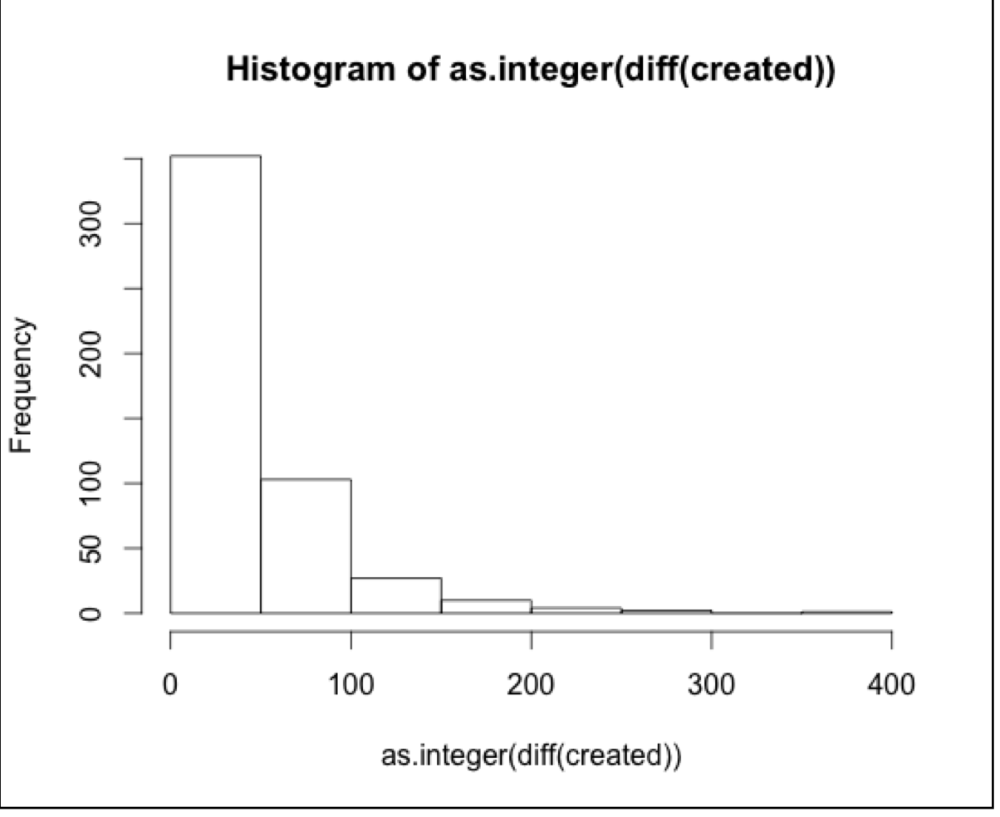
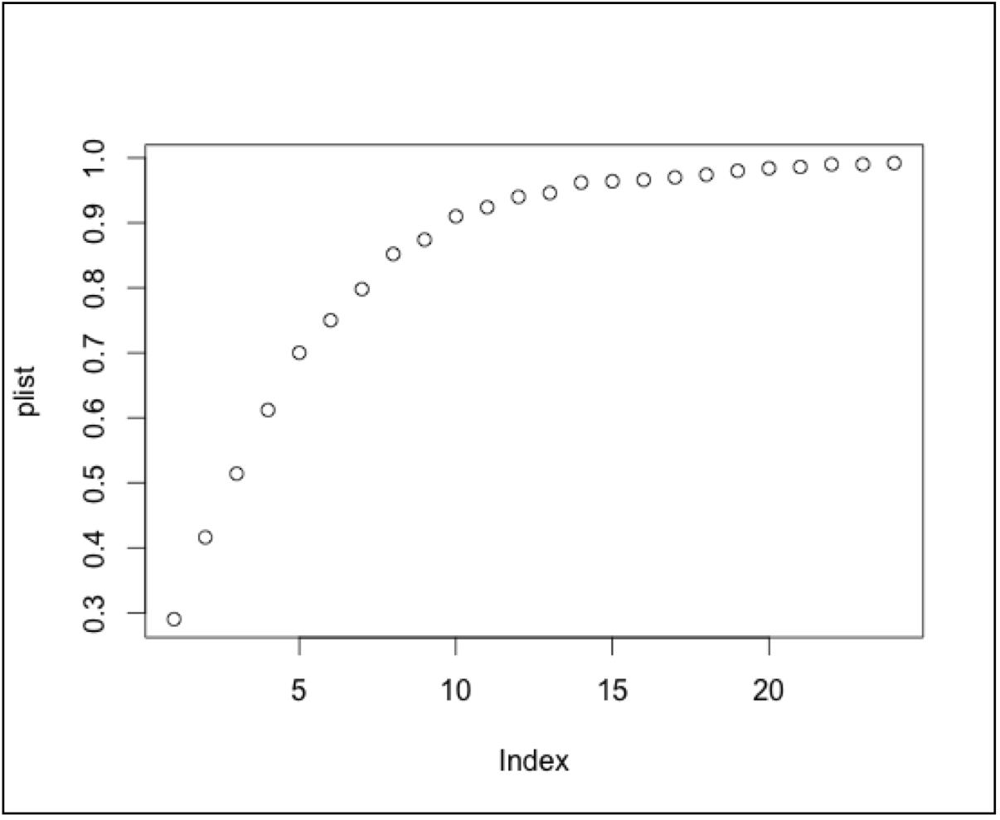

# 第10章 推特，推特


我们已在数据科学的道路上取得了很大进步：学习了基本的R技能，接触了R-studio，了解了管理第三方包的相关知识，有了创建函数，使用基本描述性统计以及采样分布与统计推论的的经验。本章，我们将使用推特这一社交媒体服务来获取并处理实时数据。

本章之前我们使用的都是一些玩具数据：虚构的的家庭数据和美国50个州以及哥伦比亚特区的人口普查数据。然而此时我们已经实践了一系列处理真实数据的技能。数据无处不在，成千上万，许多可以自由取用，包括心理学实验到电影演员等一系列有趣的话题。然而从数据的及时性来讲，没有什么能比推特社交服务更好了。你可能从实际使用经验中了解了推特是一种允许用户向全世界的人广播自己的思想的微博服务（小于140字），之后用户的粉丝（follower，即其他订阅了发送者消息的人）会阅读到该信息。推特的开发者的天才之举是决定让这些消息发布-即推特，通过twitter.com的网站对公众开放，同时支持API调用。

有了API，R对Twitter的扩展就是很自然的了。Jeff Gentry，一个财务服务行业的数据专业人士开发了twitteR（不确定如何发音，不过"twit-are"应该很相近了）这个三方包。twitteR包提供了相当简单的接口通过推特服务下载推特列表。利用twitteR的接口，可以搜索某一主题的相关推特。每条推特包含了作者发的推特文本以及许多其它有用信息，例如推特的发送时间。将这一切整合在一起，为我们提供了一种有趣的方式来观察人们对各种主题的实时思考。

使用twitteR的另一重要好处是，我们将使用大量本书前面学习的技能。

## 令牌：使用OAuth

在我们加入Rstudio创建代码前，我们还有一个重要步骤需要在推特网站完成。

2013年，推特完成了新版本应用编程接口（API）的迁移。新的API要求特定授权机-在通过软件应用搜索推特是向推特网站证明你就是声明是的那个人。推特网站的易购采用了行业标准OAuth来完成这一过程。OAuth提供了获取"secret"和"key"信息的方法，没有它将使与推特网站交互即使不是不可能也是极为困难。一下是具体步骤：

1. 如果你没有帐号，请在Twitter.com网站创建一个帐号
2. 以你的个人账户登录推特网站的开发页面 (https://dev.twitter.com)
3. 点击"My Applications"。它在网站的具体位置可能会随着时间不同而不同，不过你可以在屏幕右上角你的个人Profile图像处的下拉列表去看看。
4. 点击"Create a New Application."，回答空白处问题，填上你的主页。这是必须填写的内容，因此你需要填写响应指向的页面。相反“Callback URL”可以为空白。之后点击提交。
5. 选中下图设置中的checkbox，这样你的应用才能登陆推特网站。

6. 接着你将看到一个大量数据的屏幕，记得将它们全部保存下来。而你真正需要的部分则是"Consumer key"和"Consumer Secret"，这两部分都是字符串和数字。你的应用在R里面运行时将需要这些字符串。字符串这么长是由于它们被加密的原因。
7. 记录下来Request Token URL 和Authorize URL，大部分情况下这些不会变化，但是可能随着时间推移出现改动。
8. 点击Settings，确定设置了"Read, Write and
Access direct messages"

你可能也注意到了dev.twitter.com网站的Home->My applications窗口还有其他与OAuth相关的任务tab。通过其中"OAuth tool"你可以找回Consumer key和Consumer secret。本章会将如何使用Consumer key和Consumer secret，不过先我们需要设置好twitteR包。

## 使用twitteR

开始使用twitteR之前需要启动Rstudio，首先创建一个Rstudio "项目"，Rstudio中的项目可以把一个数据分析任务的数据集，你的变量，函数等各种信息整合在一起。对专业的R和Rstudio人生而言，为每一个项目分析任务建立一个项目是极其重要的：这样使得不同数据集，变量不会相互影响。在Rstudio中点击"Project"菜单，然后选择“New Project”，通常你会有三个不同的新项目选择，全新的“干净”项目，从一个已经有文件的目录建立项目，或者来自版本控制项目的项目。（本书后面会介绍版本控制，这对涉及多人协作的项目是极其有用的）。现在选择"New Directory"来开始一个全新项目，你可以给你的项目去任意名称，不过因为这个项目使用twitteR包，你可能会将项目命名为“twitter”。这时也还可以选择Rstudio将在电脑的哪个目录下创建你的项目。

Rstudio将启动一个干净的控制窗口以及没有任何我们在前面章节创建的变量的全新“工作空间”。使用twitteR，我们还需要加载“bitops”，“RCurl”，“RJSONIO”包，之后“twitteR”才能加载。现在让我们写一个函数来完成这一工作，而无需手工来执行没一步。首先该函数以包名为输入，它会检测该包是否已经“安装”，如果没有安装，我们的函数将进行安装，之后使用require函数将该包加载。我们给函数取名“EnsurePackge”，因为它确保我们需要的包可用。如果你不记得该怎么做了，你应该点击“File”菜单，之后点击“New”建立一个新的R脚本文件。之后输入或复制下列代码到文件中：


```r
EnsurePackage <- function(x) {
    x <- as.character(x)
    if (!require(x, character.only = TRUE)) {
        install.packages(pkgs = x, repos = "http://cran.r-project.org")
        require(x, character.only = TRUE)
    }
}
```


在Windows中，你需要保证你在新的R包存储的目录中有写权限。你可以在Windows文件浏览器中点击该目录，选择“属性->安全“，之后选择你的用户名和用户组，点击编辑，赋予所有权限。如果仍有问题，你可以查看CRAN上的Windows常见问题（FAQ）[http://cran.r-project.org/bin/windows/base/rw-FAQ.html](http://cran.r-project.org/bin/windows/base/rw-FAQ.html)

上面代码的第4行的require()函数与前面章节学习的library()函数功能相同，不过require函数在参数中传递的包不存在时还同时返回“FALSE”。同样是第4行代码中，这里还用到了"if"语句这个新概念。计算机科学家将它称为条件表达式。条件表达式会检查括号中的语句执行是否TRUE或FALSE。如果为TRUE，程序会执行大括号内的脚本（4～8行代码）。如果为FALSE，大括号中的语句将被跳过。第3行代码中"x"是将传入"require()"函数的包名，"character.only=TRUE"告诉"require()"函数，传入的x将是字符串。


Status API Training Shop Blog About © 2014 GitHub, Inc. Terms Privacy Security Contact 
最后，请注意下第三行，这里有一个“！“号，该运算符对逻值值求反。或者从技术角度讲，它是一个布尔函数NOT。当require()函数返回FLASE时，"!"会将它求反得到"TRUE"，此时大括号内的代码便会运行。
一旦你将代码输入脚本窗口后，确保选中整个函数，并点击工具栏上得”run“按钮，这样R就能获知该函数的定义。工具栏上也有一个“source on save" 按钮"，可以让我们不必每次都点击”run“。当你选择该选项后，每当保存文件时，Rstudio会重新运行所有的代码。如果你养成了每次更改代码后保存行的习惯，那么你总是会运行最新的一次代码。
现在我们已经准备好将EnsurePackage引入为twitter准备的包中。我们新建一个函数“PrepareTwitter”，该函数将加载所有我们需要的包。以下是该函数的代码:

```r
PrepareTwitter <- function() {
    EnsurePackage("bitops")
    EnsurePackage("RCurl")
    EnsurePackage("RJSONIO")
    EnsurePackage("twitteR")
    EnsurePackage("ROAuth")
}
```

以上代码简单明了，它五次调用EnsurePackage来加载我们所需要的包。你可能看到一些警告信息，不过这些警告是无害的。如果你使用windows系统，并且看到库写入错误信息，那么请查阅之前提到过的windows FAQ。
输入完这些代码后请记得务必保存该脚本。你可以用任意对你有意义的名字来命名文件，比如用“twitterSupport”。注释是软件开发者留下的可读性较高的信息，这样每个人都能知道代码的用途。R里面，注释由#标注。现在，我们在每个函数前加入注释，简短的描述该函数，就像以下这样：

```r
# EnsurePackage(x) - Installs and loads a package if necessary
```

以及：

```r
# PrepareTwitter() - Load packages for working with twitteR
```

以后我们将更好的对代码进行注释，不过到现在为止，以上的简短注释也能满足我们的最低要求。在我们继续之前，让我们先在命令行运行“PrepareTwitter”函数来加载我们所需要的包

```r
PrepareTwitter()
```

注意函数名后面的括号，就算是没有参数，我们也需要加上括号。如果没有加括号会发生什么了？你可以试验一下，这样可以加深对R语法的理解。
当你运行PrepareTwitter()时，你可能会得到一大堆的输出信息。这是因为你的电脑需要下载部分或者全部的包。你可能注意到了以上的警告信息，比如有的类被"masked"。通常情况下，该警告是指某个函数的变量由于其他同名函数和变量已被加载，因此变得不可见。一般情况下这不会有什么问题，新来的变量同同名的老变量都能正常工作。
让我们来看看Rstudio的四个区域，每个区域都包含了一些有意思的东西。左上角区域是代码/脚本窗口，在这个区域，我们可以输入我们的两个新函数。左下角是命令行区域，输出最近运行的命令的结果。右上角包含了我们的工作空间以及历史命令。对于R而言，工作空间包括了函数在内的当前所有有效的数据对象。我们新建的两个函数在该区域被列出来，这意味着他们至少被运行了一次，R已经知道了他们的存在。右下角区域包含了文件、图、包以及帮助信息。当你将刚窗口下拉到底部时，你可以看到RCurl、RJSONIO以及twitteR都已经被加载好了，已经你可以从命令行或者函数中调用这些包了。
## windows中获得新SSL令牌
对于windows用户而言，取决于操作系统版本以及软件的升级信息，有可能需要提供新SSL认证信息。认证信息有助于在internet上进行安全通信。大部分计算机都保留了最新的副本，但并不是所有计算机都这样做得。当你通过R访问internet并遇到问题时，你需要获得新的令牌：

```r
download.file(url="http://curl.haxx.se/ca/cacert.pem",destfile="cacert.pem")
destfile="cacert.pem")
```

该语句需要在R试图访问Twitter进行认证之前执行。这是因为twitteR使用RCurl进行SSL安全访问，当URL中出现“https”时就意味着在使用SSL访问。上面的语句下载最新的认证信息，并保存在当前的R工作区中。大多数时候，当你调用twitterR函数时，你需要使用cacert.pem。你可以通过增加参数cainfo="cacert.pem"在函数中进行调用。
## 使用你自己的OAuth令牌
回忆一下我们在本章开始时讨论的如何从Twitter消费者的关键信息以及私密信息。在我们从Twitter上获取数据之前，我们需要那些长长的字符和数字。
让我们从ROAuth获得认证信息来开始这个过程。请记住，在下面的命令里面，将“letter- sAndNumber“替换成你自己的twitter ConsumerKey以及ConsumerSecret。ConsumerKey是一段包含22个大小写字母以及数字的字符串。ConsumerSecret也包含字母以及数字，但长度是ConsumerKey的两倍。请确保这些信息的保密，特别是ConsumerSecret，千万不要告诉其他人。以下是所涉及的命令

```r
credential <- OAuthFactory$new(consumerKey = "lettersAndNumbers", consumerSecret = "lettersAndNumbers", 
    requestURL = "https://api.twitter.com/oauth/request_token", accessURL = "https://api.twitter.com/oauth/access_token", 
    authURL = "https://api.twitter.com/oauth/authorize")
```

这些代码看上去虽然混乱，但是比较简单，当你输入:

```r
>credential
```

你会发现整个credential对象只是你传递给OAuthFactory$new函数的参数的域的组合。我们调用下面的函数来启用该数据结构。

```r
>credential$handshake()
```

如果你是工作在windows的机器上，那么你可以使用如下命令下载新的证：

```r
credential$handshake(cainfo="cacert.pem")。
```

命令执行完成后，记下你的PIN码，然后访问如下的url并提供你得PIN码，
>To enable the connection, please direct your web browser to:
>https://api.twitter.com/oauth/authorize?oauth_token=...
When complete, record the PIN given to you and provide it here:

此时会出现一长串的字符。奇怪的是，你必须打开浏览器，然后输入你在Rsutido里面看到的输出部分。当你在浏览器中输入URL时，必须使用http://，而不是使用https://.否则Twitter不会提供任何服务。这是因为twitter服务器本身已经调用了SSL。如果你输入了正确的URL，Twitter会在你的浏览器窗口里弹出一个很大的按钮，显示”Authorize App“。当你点击该按钮，你会看到新的PIN码。把看到的七个数字输入到Rstudio的窗口里（credential$handshake()函数会一直等待输入）。在“When complete, record the PIN given to you and provide it here:”前输入这些数字，并点击确定按钮。如果顺利的话，你将获得授权。万岁！多么疯狂的过程！值得庆幸的是你不用每次都重复以上步骤，你只要保存好credential对象即可。当你退出R时，credential对象以及其他有效的对象都将被存储到工作空间。务必记得你使用的是哪个工作空间，这样在以后的工作中才能重新获取这些对象。
## 准备，出发！
现在让我们从twitter上获取一些数据。首先告诉twitteR，我们想使用新的认证信息。

```r
>registerTwitterOAuth(credential)
[1] TRUE
```

返回值是TRUE的话就意味着认证工作顺利完成，你已经可以从twitter上获取数据了。twitteR提供了searchTwitter（）函数，让我们可以根据一些条件来搜索最近的tweet信息。Twitter用户发明了一些机制来根据主题组织他们的tweet信息。该系统被称为“hashtags”，它使用符号“#”，后面跟随一些文本标记。比如说，为了表示Oprah Winfrey的粉丝，我们可以用#oprah来进行标记。我们将调用searchTwitter（）搜索关于全球气候变化的信息。hashtags.org 列出了各种最新话题的hashtag。，只要有合适的tweet信息能够被检索到，你可以选择任何你喜欢的hashtag。searchTwitter（）需要设置返回结果的最大数量。现在我们将该数量设置为500.很多时候你会发现返回结果是达不到这么多数量的。下面是我们输入的命令:

```r
tweetList <- searchTwitter("#climate", n = 500)
```

同上面一样，如果你是使用的windows系统，那么你需要使用新的认证信息，此时，我们需要使用下面的命令：

```r
tweetList <- searchTwitter("#climate", n = 500, cainfo = "cacert.pem")
```

该命令需要等待一段时间，这取决于你得网速以及tweeter服务器的处理速度。现在，我们有了新的对象：tweetList。该对象包含了我们请求的tweet数据。那么该对象的类型是什么了？我们可以使用如下的命令来查看：

```r
>mode(tweetList)
[1] "list"
```

嗯，我们之前还没有遇到过该类型的数据。R里面，list可以包含其他的数据对象，这些对象可以是不同的类型。与vector相比，vector也可以看做是一个list，只是在vector里面所有的数据类型都是一致的。实际上，假如你深入了解R的对象定义，你就会认识到我们已经遇到过list了，那就是dataframe。请记住，dataframe是包含了一些了vector的list，每个vector的长度是一样的。因此，dataframe是一种特殊的list。只是说通常list并没有类型是vector以及vector长度一致的限制。
现在我们知道tweetList是一个list。不过这个list里面包含了哪些内容了？让我们试着用str()函数来看看这个list的结构。

```r
str(tweetList)
```

啊哈！把输出的结果一直往右拉，快速查看下结果。你会发现有很多重复的数据，每20行为一个块，这些块都很类似。因此我们使用head()函数来检查下前面几行。head()函数允许你仅仅查看一个数据对象的头几行信息。对于tweetList，我们只需要查看第一行信息，我们使用如下的命令：

```r
str(head(tweetList, 1))
```

虽然看上去也很混乱，不过比刚才要好得多了。在 "List of 1,"后面，有一行以"$ :Ref- erence class" 开头，并且status被加了引号。Twitter的术语“status”指的是发布的一条tweet信息(假设它可以告诉我们发送该条信息的人的状态）。因此twitteR的作者创造了一个新的对象，称为“status”，它包含了10个域。这些域被列了出来。对于以"..$"开头的行，这里有域名以及该域所包含的数据的模式或类型。
比如说，第一个域被称为“text”，该域的类型是“chr”（字符/文本），并且包含一个以"Get the real facts on gas prices."开头的字符串。你可以看下其他域，看看能否理解他们的意思。这里还有两个数据类型："logi"代表逻辑数据，与TRUE/FALSE的意义一样。"PO- SIXct"是存储日期和时间的格式。（POSIX是老式的unix风格的操作系统，它存储的时间格式是1970年1月1日到现在时间的秒数差）。在“created”域你可以看到该条tweet信息是在2012年4月5日下午2点10分01秒被发布的。它没有显示时区，不过我们可以发现所有的Twitter都被编码为通用时间格式，或简称为UTC。



最后，请注意倒数第七行，那里写道，"and 33 methods...“。在计算机术语里面，methods是指针对某个数据的一个操作或者行为。方法是面向对象的核心。可以认为对象就像一个名词，而方法是围绕这个名词工作的一系列动词。比如说，你可以在列表里面看到”getCreated“方法，如果你在一个”status“对象的引用上使用该方法，那么这个方法就会返回该tweet消息创建的日期。
如果你运行这条命令：

```r
str(head(tweetList, 2))
```

你会发现，除了域里面的具体内容外，第二个元素与第一个元素十分相似。你也可以运行如下的命令：
length(tweetList)
这样你可以查看列表里面一共有多少个元素。你可以看到，我们的列表里面有500个元素。我们的列表里面有500个结构一样的元素，每个元素都有10个域以及其他一些东西。这引发了一个思考：我们可以把tweetList看做是一个500行，10列的数据结构！这意味着我们可以把它看做是一个dataframe。这样可以方便我们处理这些数据，就像”行和列“那章里面提到的一样。
令人高兴的是，我们可以在R里面查看一些帮助信息，将list转换成dataframe。现在我要介绍四个强大的函数as(), lapply(), rbind(), and do.call()。让我们来看看第一个函数as()，它完成类型强制转换的功能，换句话说该函数将一个类型转变为另一个类型。lapply()将一个函数映射到一个list的每个元素上执行。下面的命令里面， lapply(tweetList, as.data.frame),在tweetList的每一个元素上执行 as.data.frame函数。rbind（）函数将元素连接成行 * 行的形式。do.call()执行一次函数调用，不过与只在控制台执行不同，该函数允许可变长度的参数。我们使用的命令如下：

```r
tweetDF <- do.call("rbind", lapply(tweetList, as.data.frame))
```

你可能想要了解该命令的意思。"rbind"看上去很奇怪。这是因为do.call需要传递执行函数的名称给它。你可以也想知道为什么我们需要调用do.call.难道我们不能从命令行执行调用rbind吗？你可以自己动手试试，你会发现它返回了结果，但不是你想要的结果。区别在于rbind的参数是如何传递给它的。如果你直接调用rbind，那么lapply函数将先被执行，然后结果会形成单独的一个list并传递给rbind。相反，如果我们执行do.call(),lapply()返回的500个结果会分别传递给rbind(),这样rbind()会构造一个我们想要的数据集。调用do.call()的好处是该函数可以根据情况调用不同数量的参数。
假如我们执行上面的命令，我们将在Rstudio的右上角的区域中看到一个新的条目被建立了起来。以我们的命令为例，该条目写着“500 obs. of 10 variables.”。这就是我们想要的矩形数据集。我们可以对它开始进行分析了。我们先建立一个函数来运行我们刚才执行的命令。

```r
# TweetFrame() - Return a dataframe based on a( search of Twitter
TweetFrame <- function(searchTerm, maxTweets) {
    twtList <- searchTwitter(searchTerm, n = maxTweets)
    return(do.call("rbind", lapply(twtList, as.data.frame)))
}
```

将一些代码封装为函数是不错的做法。首先我们在函数的上方写一些注释，这样我们可以记住该函数的功能。其次，假如你测试该函数，那么你会发现twtList是在函数中被构建的，在函数执行完毕后不再存在。计算机科学家将此称之为”变量的作用域“。变量twtList只会在执行TweetFrame期间存在。一旦函数执行完毕，twtList便会消失，就像它从未存在过一样。这样能保持工作区间的清洁，避免了保存大量不会被复用的中间变量。
最后，该函数最大的好处是我们不必再关注执行do.call(), rbind(), lapply(), and as.data.frame()这些函数的细节。我们不用每次都去输入这些函数，我们只需要直接调用TweetFrame。稍后我们可以去看看代码，因此最好在return上面加一些注释，就像下面一样：

```r
# as.data.frame() coerces each list element into a row( lapply() applies
# this to all of the elements in twtList( rbind() takes all of the rows and
# puts them together( do.call() gives rbind() all the rows as individual
# elements
```

这样每次当我们想要构造tweet消息的数据集时，我们只需要调用TweetFrame函数:

```r
lgData <- TweetFrame("#ladygaga", 250)
```

该命令返回一个新的数据框，“lgData"。包含了我们搜索的条目，返回最大数量的tweet消息供我们分析。
让我们用之前返回的tweetDF来做下试验。首先为了方便起见，我们来学学attach()函数。该命令保存了相同命名的某个数据框较高的权限。我们使用$记号，就像这样一样：

```r
tweetDF$created
```

不过如果我们先运行attach(tweetDF),我们就可以直接使用created，而不需要在前面加上 tweetDF$。

```r
>attach(tweetDF)
>head(created,4)
[1] "2012-04-05 14:10:01 UTC" "2012-04-05 14:09:21
UTC"
[3] "2012-04-05 14:08:15 UTC" "2012-04-05 14:07:12
UTC"
```

让我们将这500条tweet消息的创建时间用图形的方式来展现。我们使用hist()函数绘制直方图，该函数要求我们制定大概的分类区间：

```r
hist(created, breaks = 15, freq = TRUE)
```

该命令产生如下的直方图，让我们来看看x轴（横轴),该tweet消息创建于上午4:20左右，一直持续到上午10：10，大概持续了有6个小时，这里有22个不同的柱形条，每条代表大概16分钟，我们可以称之为四分之一小时。看上去每个柱形条有大概20条tweet信息。我们可以大致认为每小时产生了大概80条tweet消息，这些消息可以用hashtag”#climate“来标记。看来这是一个热门的话题.这个分布没有特殊的形态，虽然它看上去有点像随着时间在增长。特别是从下午7：40开始。


请注意关于这些数据的重要事项：中心趋势是没有任何意义的。还记得我们在前几章讲到的每个不同州的人口数量吗？在那个例子中，考虑A州有1百万人口而B州有3百万人口，他们的平均人口是2百万是有意义的。但是当你处理时间序列时，如果你说第一条信息创建于7点，第二条创建于9点，那么他们的平均创建时间是8点，这是完全没有意义的。幸好，统计学中有很多方法来处理到达时间。让我们回顾一下Ladis laus von Bortkiewicz，一个马学家的研究（他被马踢中后去世）。他对14个骑兵团进行了超过20年的观察。他研究了骑兵的死亡时间。被马踢死的时间证明和其他所有的到达时间分布相似，比如公交或地铁的到达时间，收银台前客户的到达时间，或者电话的到达时间。所有这些例子都满足所谓的泊松分布。让我们来看看tweet消息的创建时间是否满足泊松分布。
现在我们拥有tweet消息被发布的具体时间，这些时间用POSIX方式被编码。另外一种思考方式是可以把这些时间看做是新tweet消息和前一条消息之间的时间间隔。为此，我们需要将时间进行处理，把当前tweet的创建时间减去前一条信息创建的时间。为了能够实现该计算，我们必须确保我们的数据是以时间进行升序排序的。在R里面，我们可以使用order()函数，并同方括号一起使用。
在前面的章节中，我们有所提及，在R里面方括号是允许对一个列表、向量或者数据框进行索引。比如说，myList[3] 会返回myList的第三个元素。记住，矩形形态的数据框是一个二维结构，我们通知指定行标和列标可以获得任何一个元素，比如 myFrame[4,1] 会返回第四行第一列的元素。为了获取某一列的所有数据，在括号里面我们不要写行标，myFrame[ , 6]会返回第六列的所有数据。同样的，如果我们想获取某一行的所有数据，我们在括号里面不要填写列标，myFrame[10, ]会返回第十行的所有数据。我们也可以返回多行的数据，比如myFrame[ c(1,3,5), ] 会返回1，3，5行的数据（该命令会返回所有的列，因为我们并没有指定列标）。我们可以使用方括号的这个特性，并且利用order()函数来记录这些列。我们使用order()对我们想排序字段进行排序，然后他会返回一组排好序的行索引。将这些想法组合在一起，就产生了如下的命令：

```r
tweetDF[order(as.integer(created)), ]
```

 这条命令按tweet创建时间来排序。让我们从内到外的来分析这条命令。我们首先将数据类型强行转化为整型-这样 它将返回至1970年以来的秒数。我们在order里面嵌套使用该函数。order（）返回按时间排序的行索引。然后方括号内将列标置为空，这样会返回所有的相关行数据。
 我们可以使用函数返回的数据框。我们可以把返回值重新赋值给tweetDF。我们也可以像如下一样新建一个变量，
 
 ```r
 sortweetDF <- tweetDF[order(as.integer(created)), ]
 ```

 如果你使用这种方式的话，记得在tweetDF上执行detach，并且在sortweetDF上执行attach。
 
 ```r
 detach(tweetDF)
 attach(sortweetDF)
 ```

另外一种更好的做法是将排好序的数据传给我们在本章开头开发的TweetFrame（）函数。让我们在本章挑战里面做做这个练习。现在我们可以使用sortweetDF继续进行分析。
从技术上来看，如今我们拥有了一个时间序列变量。统计学家有一系列比较方便的方法来处理时间序列。R提供了内置的diff()函数来计算列表里面相邻元素的秒差。试试如下的命令：

```r
diff(created)
```

你会得到一个以秒为单位的时间差列表。你会看到大量的时间差，有的间隔几分钟，不过大多数都接近0.你可能会注意到，列表里面只有499个数据，而不是500个数据。这是因为第一个元素的时间差不会被计算。让我们把我们的数据绘制成图形：

```r
hist(as.integer(diff(created)))
```



因为hist() 无法处理时间差，所以我们用 as.integer()函数将时间差数据强制转化为了整型。柱状图显示大量的分组tweet消息都是在前一条消息被发布后50秒内被创建的。只有少量的消息发布时间间隔是在50到100秒。这是典型的泊松分布。与分布时间不同，我们可以来计算时间差的平均值。

```r
mean(as.integer(diff(created)))
[1] 41.12826
```

在使用平均值来衡量这种明显倾斜的分布时必须十分小心，因为平均值是用来衡量中心趋势分布的。还记得我们前一张讨论过的统计模型的差异吗（频繁值）？平均值和频繁值是不同的：

```r
>library("modeest")
>mfv(as.integer(diff(created)))
[1] 0
```

我们先加载modeest包，mfv函数显示，出现的最频繁的时间差是0！
同样，我们使用median来查看中位数信息，我们发现一半的tweet消息发布的时间差是在半分钟以下：

```r
>median(as.integer(diff(created)))
[1] 28
```

下一章我们将详细讨论泊松分布的特点以及如何使用平均值。
最后，在结束本章前让我们再来看看这些数据。如果我们选择另外一个时间间隔，比如说10秒、30秒或者60秒，我们可以看看有多少条tweet消息在这个间隔中被发布。下面的代码可以查看指定间隔内tweet消息的发布数量：

```r
>sum((as.integer(diff(created)))<60)
[1] 375
>sum((as.integer(diff(created)))<30)
[1] 257
>sum((as.integer(diff(created)))<10)
[1] 145
```

你也可以用比率来思考问题，比如145/500=0.29。一旦我们有了这些比率，我们就可以用概率的方式来思考问题：有29%的可能性下一条tweet消息会在10秒以内被发布。我们可以建立一个函数来列出所有的概率。你可以在本章末尾找到该函数。有些语法我们没有涉及（比如loop）。不过别太在意。下面是该函数的输出：



这是典型的泊松分布。x轴以10秒为间隔（坐标5表示50秒）。这个图是累积分布图。它是值下一条消息会在x坐标表示的时间间隔内被发布。比如说，x坐标5对应的y坐标值是60%，这意味着有60%的可能性，下一条tweet消息会在50秒内被发布。不过请记住，这个估计值只在我们这个样本中有效。
下一章我们将详细讨论泊松分布，学习如何比较两个泊松分布来找到哪个hashtag更热门。
让我们回顾一下本章的知识。第一，我们使用R-studio创建了一个干净的工程。第二，我们创建了三个有用的函数，下一章我们会复用这些函数。第三，我们实践了如何安装R的扩展包。特别是我们加载了Jeff Gentry写得tweeterR包以及它所依赖的其他三个包。第四，我们使用twitteR获得了数据。第五，我们转换了数据。比如建立了发布时间列表。最后，我们开始分析和可视化这些数据，推测出发布时间符合典型的泊松分布。

**本章挑战**

修改本章开头创建的TweetFrame（）函数，让它可以按照tweet消息创建的时间排序。这会用到前面讨论过的sort（）函数，把该函数加到TweetFrame里面。暗示：在TweetFrame里面建立一个临时数据框，你不需要连接它到内存里面。使用$记号引用你要用到的变量。


**本章资源**

http://cran.r-project.org/web/packages/twitteR/twitteR.pdf

http://cran.r-project.org/web/packages/twitteR/vignettes/twitteR.pdf

http://en.wikipedia.org/wiki/Ladislaus_Bortkiewicz

http://en.wikipedia.org/wiki/Poisson_distribution

http://hashtags.org/

http://www.inside-r.org/packages/cran/twitteR/docs/example 

Oauth

http://www.khanacademy.org/math/probability/v/poisson-process-1

http://www.khanacademy.org/math/probability/v/poisson-process-2

https://support.twitter.com/articles/49309 (hashtags explained) 

http://www.rdatamining.com/examples/text-mining
