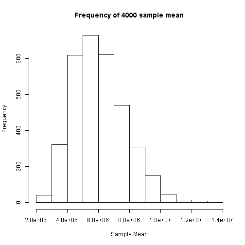

第七章：罐子中的样本
==========

----
<center>

</center>
----

抽样分布是理解统计推断的关键概念。为了理解随机性在抽样时所产生的影响，很多讲解抽样分布的方法都提到了从罐子中抽取弹球或糖果这样的经典例子。通过前面提到的美国人口的例子，我们可以清楚的看到尽管总体的分布不是正态的，但其样本均值的分布却服从正态分布。

想象你拥有一个装满了红色和蓝色糖果的罐子。罐子中放入的红色糖果和蓝色糖果各有100颗，但这些糖果在放入罐中时是混合在一起的。如果你从罐中随机抽取8颗糖果，你会得到什么颜色的糖果？如果抽取如想象中般顺利的话（虽然通常都没那么走运），你将会抽到4颗红糖果和4颗蓝糖果。红的和蓝的各占一半，这个比例和罐中的红蓝比例是一样的。当然了，你很难抽到这个结果，是不？除了4红4蓝的组合，你也可能会抽到3颗红糖果和5颗蓝糖果，或者其他各种你能想到的组合。事实上，尽管概率很小，但你还是有可能抽中8颗红色的。虽然有多种可能，但仅就一次抽取结果来看，我们是无法预测会抽到红和蓝的哪种组合的。而这种不确定性，就是能够以无法预知的方式来影响你抽取结果的随机性的力量。

我们现在提出一个有趣的想法，这虽然对预测单次抽取结果没什么帮助，但却能很好的展示多次抽取的*长期趋势*。从罐子中抽取8颗糖果，数一数其中有多少红色的，然后将所有的糖果都放回罐中。我们并不需要数蓝色糖果的数量，这是因为 `8 - 红色糖果的数量 = 蓝色糖果的数量`。将罐中的糖果晃动一下，这样能混合的更好一些，然后再抽取8颗糖果，同时数一下红色糖果的数量。将这种操作重复多次，我们可以对每次记录的结果用下面的表格来表示：
<center>
<table>
   <tr>
      <td>抽取次数</td>
      <td>红色糖果的数量</td>
   </tr>
   <tr>
      <td><center>1</td>
      <td><center>5</td>

   </tr>
   <tr>
      <td><center>2</td>
      <td><center>3</td>
   </tr>
   <tr>
      <td><center>3</td>
      <td><center>6</td>
   </tr>
   <tr>
      <td><center>4</td>
      <td><center>2</td>
   </tr>
</table>
</center>

注意到表格左边的列就是对抽取次数的计数而已。表格右边的列是我们感兴趣的内容，它列出了每次抽样中的红色糖果数量。在本例中，红色糖果的数量真是天南海北。在第4次抽样时，我们只抽到了两颗红色糖果，但是在第3次抽样时，我们却抽到了足足6颗红色糖果。但是本例最有趣的地方就是，如果你将这4次抽取的红色糖果数量进行*算术平均*，你会得到平均每次抽到*正好4颗红色糖果*的结果，而这正是我们期望的红蓝各半的罐子中应该抽出的结果。以上只是一个人为制造的例子，而我们在平时抽取时，很难在仅仅4次抽取之后就遇到这么好的平均的结果。但是如果你将随机抽取这一操作，进行了4000次，你将会肯定得到一个接近 **平均每次抽到4颗红色糖果** 的完美结果。

从总体中不断的抽取子集的过程称为“抽样”，而经过大量的抽样之后，我们会最终得到抽样分布。注意到，在刚才这句话中，我们用到了“总体”这个词汇，用来代表我们从什么地方做的抽样，这也是它的统计含义。在前面章节的例子中，我们的数据集包含美国各个州的人口数量，这个“人口”与“总体”同样使用英文单次 population 可以说是一个巧合。下面，我们使用 R 来帮助我们从美国各州人口数据集中抽取大量样本。

R 中有一个很便捷的函数 sample()，可以用来从数据集中简便的抽取样本。我们可以用它来从我们的数据集中抽取样本：


```r
set.seed(31415)
sample(USstatePops$V1, size = 16, replace = TRUE)
```

```
##  [1]  1852994  4339367  3574097  2967297  2915918  4533372  1360301
##  [8]  5773552  6724540  6346105  3574097  3751351  1052567 37253956
## [15]   814180  3046355
```


(译者注：原著中并未使用set.seed()来设置随机的种子，这会导致读者的可重复性研究非常困难。在本章中我们统一将种子设置为31415。读者也如此设置，便可实现和我们相同的抽样结果。)在本例中，注意到我们调用的sample()函数含有三个参数。第一个参数是数据源。
对于第二个和第三个参数，为了让 R 能够正确识别，我们采用了“命名参数”的方
式来调用，而不是单靠这些参数在参数列中的位置。参数 `size = 16` 可以让 R 
从总体中抽取16个州的人口作为样本。参数 `replace = TRUE` 则规定了一种统计
学家经常用来简化数学证明的抽样方法。对我们来说，采取放回抽样还是不放回抽
样通常没有实际的影响，所以我们直接使用统计学家的常用方法。

相较于给抽取的各色糖果计数，我们在处理类似于各州人口的这类数值时，对其算数平均数，或者称为均值，更感兴趣。于是我们可以让 R 使用mean()来计算所抽取的样本均值：


```r
set.seed(31415)
mean(sample(USstatePops$V1, size = 16, replace = TRUE))
```

```
## [1] 5617503
```


从上面的mean()函数可以看出，我们又遇到了函数的嵌套调用了。我们在mean()函
数的输出中并未看到从51个州中随机抽取的16个州人口数值，而是看到了mean()函
数直接用这16个数来为我们计算出来的均值。如果你的记忆力很好，或者往前面的
章节翻一下，你会看到51个数值的均值是 6053834. 于是你会发现我们从这16个州
的样本获得的均值真的是离总体的均值相差的有点远。我们是不是应该感到焦虑？
当然不是！我们知道，当抽取样本时，无论是抽取糖果，还是抽取各个州，我们的
样本均值永远都不会和总体均值正好一样。其实我们并非对某一次抽样的结果感兴
趣，而是要专注于长期抽样的结果。于是，我们现在要让 R 来帮我们做重复抽样了，不是抽取1次、4次，而是400次甚至4000次。和其他的编程语言一样，R 有很多方法可以重复某个操作。其中最简单的一个方法非replicate()函数莫属。让我们先尝试一下重复4次：


```r
set.seed(31415)
replicate(4, mean(sample(USstatePops$V1, size = 16, replace = TRUE)), simplify = TRUE)
```

```
## [1] 5617503 3945129 6510150 4407374
```


简单的不可思议吧！我们仍然使用了刚才用过的命令，即用来计算16个州的均值的
mean()函数。只不过这一次，我们将mean()函数作为一个参数放到replicate()函数
里面，于是我们才可以一次又一次的求均值。其中的 `simplify = TRUE` 参数是让 
R 将函数运行的结果以一个均值构成的向量形式返回，而这正是我们想要的形式。
由于我们只将mean()函数运行了4次，所以我们不会看到满屏的数字。从刚才的尝试
来看，我们可以很轻易地将求均值的过程重复400次。你可以自己试一下，看看结果
。至于在本书中，我们要将replicate()函数整个塞进另一个mean()函数，于是我们
可以得到400个样本均值的平均数。我们来看一下：


```r
set.seed(31415)
mean(replicate(400, mean(sample(USstatePops$V1, size = 16, replace = TRUE)), 
    simplify = TRUE))
```

```
## [1] 5983180
```


在上述命令中，最外层的mean()函数地位与之前命令的不同。将这个多层嵌套的命令的效果，用语言来描述一下就是：a)从51个州的总体中抽取400个样本容量为16的样本; b)对每一个样本计算其样本均值，并将均值保存到一个列表中; c)当计算完这400个均值后，计算包含有400个均值的列表的均值。从刚才的计算结果可以看到400个样本的均值是5983180. 虽然这个值和总体均值仍然不相等，但是已经接近了。我们距离总体均值的真值大概70000多，大概是1.16%(更精确的数值为70654/6053834 = 1.167%)。你可能也注意到了，即使你有一个速度较快的电脑，运行刚才的命令也得花一些时间。因为刚才的命令的确包含了很多操作！让我们更进一步，看看我们是否能更加接近总体均值：


```r
set.seed(31415)
mean(replicate(4000, mean(sample(USstatePops$V1, size = 16, replace = TRUE)), 
    simplify = TRUE))
```

```
## [1] 6052941
```


现在我们更加接近真值了！我们得到的均值距离总体均值的真值只差不到千分之一
！你可能注意到你在运行上述几个命令时得到的结果与我们有少许不同，这是因为
你在运行sample()函数时，随机抽取的400或4000个样本与上述命令得到的不同，但
是最终均值结论的精确性却相差不多。(译者注：这是由于原著中没有使用
set.seed()来明确生成的随机序列，读者如果按照译文中的命令来执行，是会得到
与我们完全相同的结论的。我们也建议读者在任何涉及到随机抽样的模拟中，添加
set.seed()，以便将来的可重复性研究。)

我们准备进行下一步了。这次我们不用一个简单的算术平均来概括抽样分布的均值
了，我们使用更复杂的直方图来观察抽样分布的均值序列。

这个直方图展示了4000个均值的频数分布。对这张图详细观察可以训练你阅读频数
直方图的能力。这个直方图具有典型的近乎于钟形的但仍然有点右偏的形状。最高
的，也就是频数最大的区间正好和均值真值6053834不远。

另外，你能否自己找出生成这张直方图的命令？你只需要将前面的命令之中的最外
层mean()函数替换为hist()函数即可。在本例中，代码如下：


```r
set.seed(31415)
hist(replicate(4000, mean(sample(USstatePops$V1, size = 16, replace = TRUE)), 
    simplify = TRUE), main = "Frequency of 4000 sample mean", xlab = "Sample Mean")
```

 


这是一个伟大的时刻，请让我们做一下深呼吸。我们刚刚仅用短短几页就概括了统
计思想在数百年间的成果。事实上，我们提到的有两个重要思想，“大数定律”和
“中心极限定理”。这两个重要理论的确花费了像Gerolamo Cardano(1501-1576)和
Jacob Bernoulli(1645-1705)这些数学家们数个世纪才最终得到。如果你去查阅这
些理论，你会发现有很多令人迷惑的数学论证细节，但对我们来说，在这之中是两
个浅显的道理。首先，如果你运行了同一个统计过程很多次数，则最后通常会收敛
到一个稳定的结果。对本例来说，我们知道50个州加上哥伦比亚特区（即华盛顿首
府）的平均人口是多少。这51个观测值就是我们的总体，此时我们想知道要像得到
这个均值真值的较好的近似，我们需要抽取多少个容量为16的样本。我们了解到只
抽取一个样本会得到较差的结果。抽取400个样本能够得到距离真值只差1.16%的较
小的误差。而抽取4000个样本得到的均值距离真值的差距都不超过千分之一。如果
我们将抽样过程重复40000次乃至400000次，我们会得到和真值6053384极端接近的
所有样本的均值。

其次，当我们将大数定律纳入考虑，并将其运用到样本均值时，我们发现样本均值
形成的分布开始向钟形或正态分布靠拢，所有样本均值的均值也和总体均值真值越
来越近。样本容量越大，则均值接近真值的速度也越快，相反，当样本容量小的时
候，你就得抽取非常多的样本来使得样本均值的均值和总体均值足够接近。为了说
明这一点，我们举一个有趣的例子，该例中样本容量大于16. 我们抽取的样本容量
为 `n = 51`(与总体的单位数量相同)，共重复抽取100次：


```r
set.seed(31415)
mean(replicate(100, mean(sample(USstatePops$V1, size = 51, replace = TRUE)), 
    simplify = TRUE))
```

```
## [1] 6016650
```


现在我们的计算结果与总体均值已经相差不超过1%了。你可能会觉得有点摸不到
头脑，“等一等，难道样本容量为51不就是把总体中所有的单位都抽取了吗？”这
的确让人迷惑，但这个问题可以追溯到前几页里我们提到的可放回抽样（当时我们
在抽样命令里也是使用了 `replace = TRUE` 这个参数）。可放回抽样的意思是随
着你从总体中抽取了一个单位来放到你的样本中，紧接着你就把它又放回了总体的
单位里去，这也意味着你有潜在的可能性在接下来的抽取过程中再次抽中它。如前
文所说，我们已经省略掉了相应的证明部分，而这除了会让你迷惑以外，并不产生
任何问题。事实上，我们可以让样本容量更大，而不会带来任何麻烦：


```r
set.seed(31415)
mean(replicate(100, mean(sample(USstatePops$V1, size = 120, replace = TRUE)), 
    simplify = TRUE))
```

```
## [1] 6028504
```


这个命令对容量为 `n = 120` 的样本重复抽取了100次。让我们来看看抽样分布的
均值和总体均值有多么的接近了！回顾之前我们提到过的，每次你运行这个程序，
你都会得到稍微不同的结果，这是因为每次抽取的都是不同的样本（译者注：如果
使用了set.seed()就不会遇到这种情况）。但是按照以往的经验，随着统计学家们
用 `n` 来表示的样本容量越来越大，你对总体均值的估计也会越来越接近真值。相
应的，如果你抽取更多的样本量，你的估计也是越来越准的。

现在，如果你已经从刚才的状况缓了过来，那么就让我们来进一步的利用抽样分布来做更多的事情吧。首先，让我们将所有样本均值保存下来，以便我们可以对这列数进行下一步的计算：


```r
set.seed(31415)
SampleMeans <- replicate(10000, mean(sample(USstatePops$V1, size = 5, replace = TRUE)), 
    simplify = TRUE)
```


我们是将所有的抽样均值保存到一个称为“SampleMeans”的新向量中。我们应该有10000个样本均值：


```r
length(SampleMeans)
```

```
## [1] 10000
```


这些抽样均值的算术平均数应该和我们的总体均值6053384相当接近：


```r
mean(SampleMeans)
```

```
## [1] 6062372
```


你可能还想要对 SampleMeans 生成一个直方图，来看看频数分布是如何的。目前，我们所需要查看的只是这列抽样均值数列的一个总括：


```r
summary(SampleMeans)
```

```
##     Min.  1st Qu.   Median     Mean  3rd Qu.     Max. 
##   822000  3880000  5380000  6060000  7650000 24500000
```


如果你需要回顾中位数（median）和分位数（quantile）的概念，可以回头看看第3章-行和列。

这个总括里包含了很多信息。首先让我们来看看最大值（max）和最小值（min）。
这列样本均值的最小值是822000。让我们思考一下，当我们知道总体均值是那么大
的时候，怎么会抽取到均值这么小的样本呢？怀俄明州（Wyoming）在那个样本中一
定被抽到过好几次吧！答案和伴随着抽样过程的随机性有关。如果你运行某个随机
抽样程序10000次，那么你肯定会遇到几个很怪异的样本的。这很像是买彩票。你买
的大多数彩票都是正常的——中不了奖的。但是就在某个时刻，你也会遇到那个极
其特殊的大奖。抽样过程和此类似：极端特殊的情况是很不寻常的，但是如果你抽
样的次数足够多，你也会遇到这种情况的。对于最大值我们也有类似的结论：我们
抽到的最大的样本均值24500000，比总体均值大得多。

SampleMeans的中位数5380000和均值6060000比较接近，但并不完全相同。这是因为
我们的样本均值分布有点右偏（数值较大的右侧尾巴比对称情况下要长，这是由于
原始分布是反向J形的）。中位数是很有用的，这是因为它把所有的样本等分为两半
：50%，或者5000个样本均值是比5380000大的，另外一半是比5380000要小的。因此
，如果我们此时要从总体中再随机抽取一个样本的话，那么它就有一半的可能性大
于中位数。分位数能够帮助我们更好的对数据进行分割。第三分位数将数据较小的
75%和较大的25%分开。因此只有25%的样本均值大于7650000。这意味着如果我们再
从总体中随机抽取一个样本的话，那么这个样本均值只有25%的可能性是大于
7650000的。类似的，第一分位数告诉我们，如果随机抽取一个新的样本的话，那么
样本均值只有25%的可能性是比3880000要小的。

