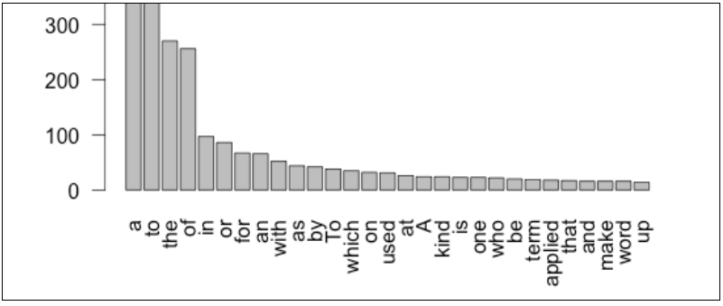

# 数据科学：多面技能

**本节主要内容**

1. 数据科学需要很多其它工作都需要的一个重要技能-数据分析能力，但是这不是唯一需要的技能
2. 通过超市自动收款系统（POS）案例来展示数据科学的各种挑战
3. 数据科学家在数据架构，数据获取，数据分析，数据归档这四个与数据科学相关的设计与实施领域扮演积极角色
4. 案例中突出强调了沟通技能，数据分析技能，伦理推理技能

有人可能一提到“数据科学”这个词就会在脑海里浮现出统计学家穿着白色的实验服眼睛盯着闪烁的计算机屏幕输入一行行的数据的图片。真相远非如此，首先统计学家不是穿着白色的实验服，这一“时髦”是给生物学家，医生以及其他需要保证在充满非普通液体环境中保持服装干净的人预留的。其次，这个世界上大多数数据是非数字化，非结构化的。这里非结构化是说数据不是以整齐的行列存在的。想象一下网页中的各种图片，朋友间的短消息，这当中很少有数字。尽管公司，学校，政府使用比如产品销售，成绩平均绩点（GPA），税收评估等大量数字信息是事实，，不过在这个世界上还有大量的其他信息数学家和统计学家需要观测和处理。因此尽管优秀的数学知识很有用，但数据科学的世界中还有更多我们已经习惯了的字词，列表，图像声音等其它信息也需要处理。

此外数据科学不只是简单的分析数据。许多人喜欢分析数据，他们可以一整天查看直方图与均值，而另一些人则更喜欢其它的工作。数据科学需要各种角色，多面技能。下面让我们以购买一盒麦片中涉及到的数据为例来分析。

不管你喜欢的麦片是水果型，巧克力型，纤维或者是坚果类，首先你会在购物清单里面加入“麦片”这一项。尽管它只是你用铅笔潦草写在信封背面，此时这一计划的购物已经是一份数据，当你到达杂货店，数据会提醒你从货架上取下一大盒水果味麦片放到购物篮里面。在收银台，收银员会扫描盒子上的条码，收款机会记录下价格。而库房里面，计算机会告诉存货管理人员因为你买的是商店里面最后一盒麦片了，所以商店需要向经销商下一个新订单了。同时由于你有一张针对你买的麦片的优惠卷，收银员需要扫描它，给你一个之前预设的折扣。在周末，一份所有来自该麦片制造商的优惠卷信息报表会传给麦片公司，以便他们向杂货店偿付他们向顾客所发的优惠卷折扣。最后，月末的时候，商场经理会看到一组五颜六色的饼图，上面展示了各种不同麦片的销售信息，由于水果类麦片销量强劲，经理决定在商场的有限货架空间中摆放更多的不同种类水果麦片。

小小的一点信息从你在购物清单上潦草涂写开始，在不同地方结束，最重要是它来到经理的桌上帮助决策。在从你的笔尖到经理的桌上的旅程中，数据经历了各种转化。除了计算机会终结或者存储数据以便长期使用外，大量如条码扫描仪之类的其它硬件也会涉及数据的收集，处理，转换和存储。此外，各种不同软件也被用于组织，汇总数据，将数据进行可视化与展示。最后各种“人类系统”也会与数据工作相关。有人需要决定购买或者安装什么系统，谁有权访问什么数据，数据完成使命后如何处理。在前面描述的场景成真之前，连锁杂货店的人员与和合作方需要上千次的具体决策与协商。

显然数据科学家不会参与到上面的每一步中，比如数据科学家不会设计与生产计算机，条码扫描仪等。那么数据科学家最重要的角色是什么呢？一般而言，数据科学家最重要的工作是以下关于数据的四个A：数据架构（data architecture），数据获取（data acquisition），数据分析（data analysis），数据归档（data archiving）。
